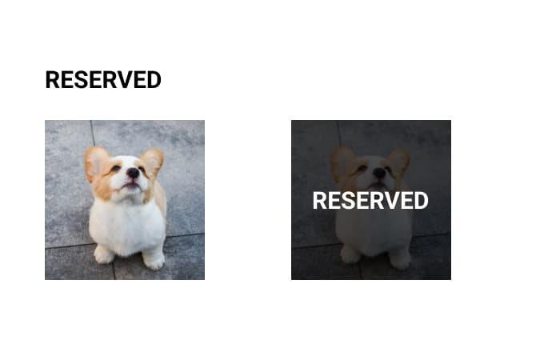
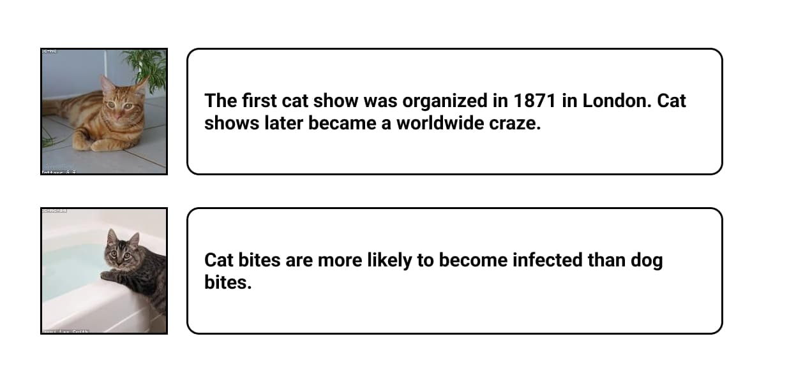
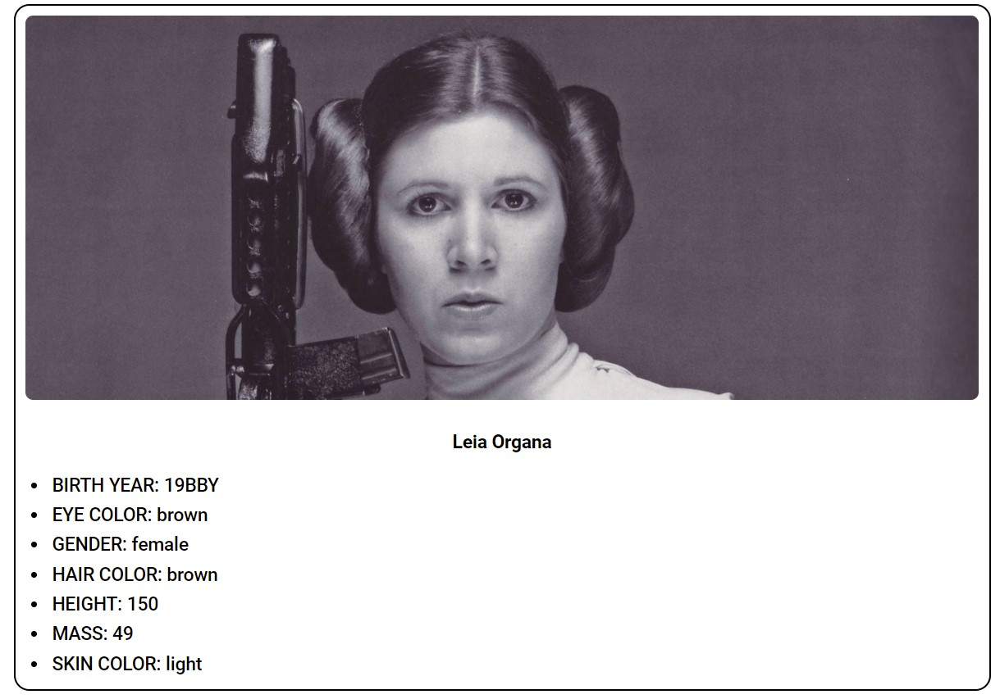

1. При завантаженні сторінки міняти дату в хедері на поточну у форматі день місяць, рік. Місяць обов'язково словом (січень, лютий тощо). Встановити розмір шрифту в `24px` та жирність `bold`
2. Додати до всіх зображень з галереї собак alt. Текст брати з 'data-атрибуту'.
3. Видалити всі зображення собак із порожнім атрибутом `src`
4. Всім собакам з `data-аттрибутом` `reserved` змінити дизайн

5. Додати галерею котів на сторінку. Використовувати дані з масивів `catsFacts` та `catsData`

6. Додати кнопку `Очистити котів` при натисканні на яку видаляти всіх котиків зі сторінки
7. Виділити всі слова `cats` (не враховуючи регістр) червоним кольором.
8. Малювати на екран картки героїв фільму "Зоряні війни". На картці має бути аватарка героя - верхній блок розтягнутий по всій ширині висотою 400px, заголовок з ім'ям героя, маркований список всіх характеристик героя.

